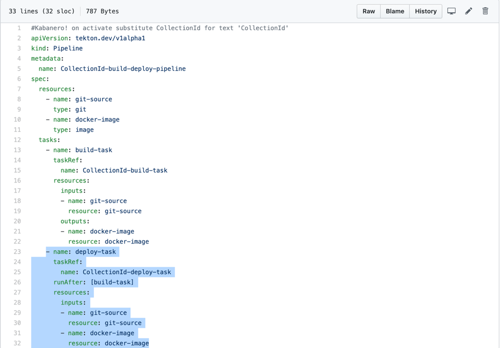
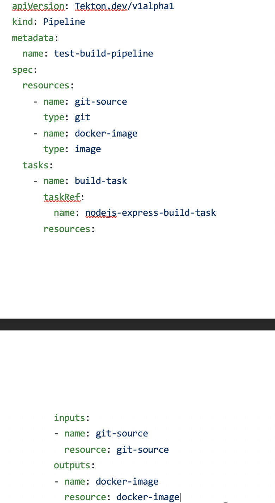

:page-layout: doc
:page-doc-category: Reference
:page-title: Jenkins Integration with Kabanero
:sectanchors:
= Jenkins Integration with Kabanero

The goal of this guide is to show existing Jenkins users how to use Tekton to build images from their code repository and have Jenkins deploy using the image. The flow looks something like this:

image::jenkins-tekton.png[]

== Prerequisites
In order to follow along with this hands-on guide, you’ll need the following pre-requisites:
* OpenShift 3.11 
* Kabanero Foundation (cloned)
* Kabanero Pipelines (cloned)
* Appsody (installed)
** Links to each of the above projects aregiven under reference section. Each project website/github listsnecessary system requirements.

== Intended Audience:
This hands-on guideis directed towards anyone who has used Jenkins before and familiar with the  fundamental  concepts  of  microservices,  Docker,  Kubernetes, OpenShiftand  Tekton.  The intent is to show an existing Jenkins user/administrator how to build the image using Tekton and deploy using Jenkins.

== Build Steps by Tekton:

* Pipeline creation:

The script to create a pipeline is included with Kabanero-pipelines project. This template script contains both build and deploy tasks,but wewill remove the deploy task from this file to have Tektonperform only build task. Go to Kabanero-pipelines folder which you recently cloned.
From the bottom-half of thefile pipelines/incubator/build-deploy-pipeline.yaml, remove the highlighted section (i.e. the deploy-task). Save and close the file.Rename the file to test-build-pipeline.yaml.

For our example, we’ll be using nodejs-build-task for “build-task” section and name the pipeline test-build-pipeline. Once finished, your file should look like following:

Let’s create the pipeline by invoking the following command:oc apply -f test-build-pipeline.yaml -n KabaneroNotice the -n Kabaneropart which indicates the namespace Kabanerowhere the pipeline will be created. Note: Change the names on lines 5, 15,25 (the ‘name’ fields) in the template file to lowercase letter only names.  The taskRef name must be one of the tasks installed in the OpenShift cluster.  Here, we’re using"nodejs-epress-build-task".

* PipelineRun creation:

(Optional: You can use any project of your choice for this guide. If you don’t have a project already, appsody init nodejs-expresswill get you a sample nodejs-express application)Go to Kabanero Foundation project which you cloned and open the file scripts/appsody-Tekton-example-manual-run.shOn this file, edit the parameters DOCKER_IMAGE and APP_REPO to reflect the code repository and image repository of your choice. For our example, we’ll be using the docker repository on OpenShift.Execute the file by ./appsody-Tekton-example-manual-run.shand this will create the PipelineRun binary for you. Use oc get pipelinerunto see running PipelineRuns and oc get pipelinerun-o yaml to see the PipelineRun execution steps.*Work-around: If you see your pipeline-run failing at validate-collection-is-activestep, this is a known issue for projects created using appsody-init command. Edit your appsody-config.yaml file under the appsody projectas follows:Remove appsody/nodejs-express:<ver> and add Kabanero/nodejs-express:<ver>. Save and close the file and this should get your PipelineRun to succeed.*

* Image creation and push to docker repository:

Log in to your OpenShift dashboard and select “Kabanero” namespace. Navigate to Overview --> Builds --> <project-name> and you should be able to see the newly created image.The <project-name> is the same as your github project name.

== Deploy Steps by Jenkins:

* JenkinsFile creation:

Follow theJenkinsfile template from reference sectionand edit the docker-hub source to your own image repository. Push this Jenkinsfile to your github repository in the root location.

* app-deploy.yaml creation:

appsody-deploy –-generate-onlyThis generates an app-deploy.yaml file which other tools can use for application deployment (Jenkins, in this case). Commit and push this file to the root of your project. Jenkins creates the “AppsodyApplication” resource in the OpenShift cluster and makes appsody to deploy the application using app-deploy.yaml file.

* Jenkins project and pipeline creation:

From OpenShift Catalog, create a Jenkins (Ephemeral) instance. Create a new project and specify Github as the source. Provide your github account/repo details and choose multi-branch pipeline creation. Jenkins will automatically detect the jenkinsfile fromyour github repo and start deployprocess.

* Jenkins deployment and verification of running application:

If everything went smooth, you should be able to see the successful deployment underOpenShift portal’sApplication --> Deployment and see the URL of running application under Application --> Deployment --> Routes. 

== Reference:

** Sample Jenkinsfile: include::sample_jenkinsfile
** OKD Installation: https://docs.okd.io/latest/install/running_install.html (at the time of writing this guide, version 3.11 is the preferred one)
** Appsody Installation: http://appsody.dev
** Kabanero Foundation: https://github.com/Kabanero-io/Kabanero-foundation
** Kabanero Pipelines: https://github.com/Kabanero-io/Kabanero-pipelines

